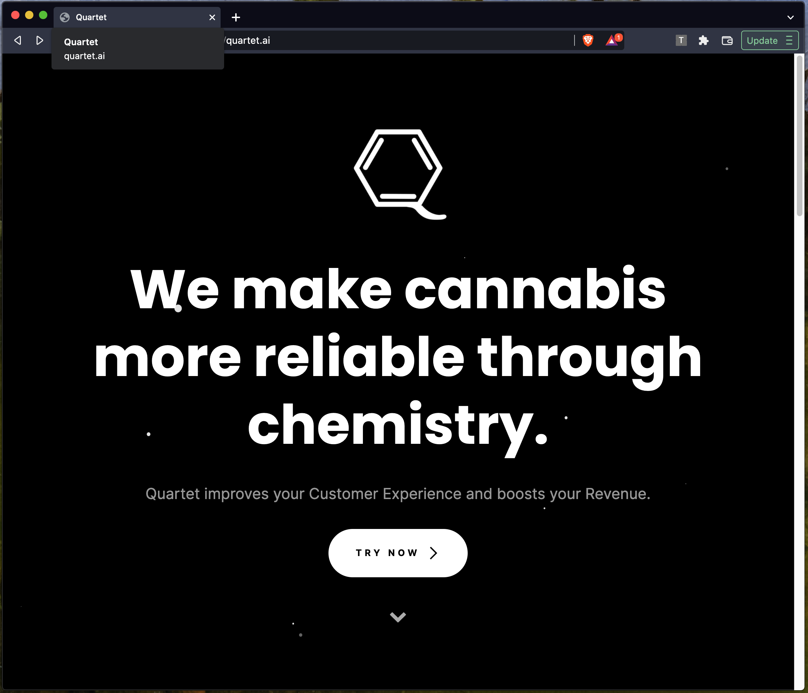
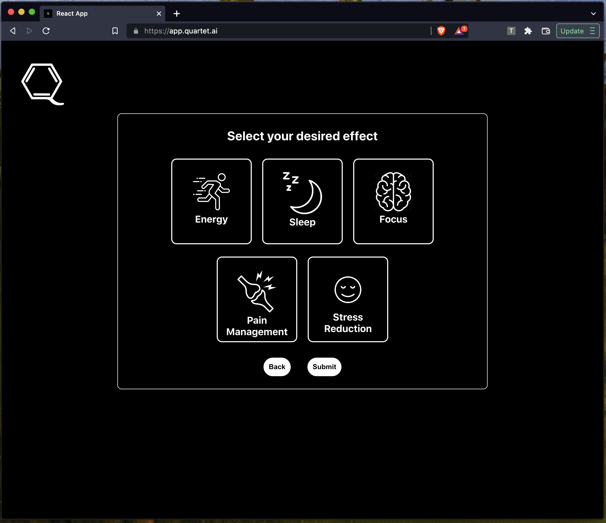

<a name="readme-top"></a>


<!-- PROJECT LOGO -->
<br />
<div align="center">
  <a href="https://github.com/ryansereno/quartet-app/" >
    
  </a>

<h1 align="center">Quartet</h1>

  <h2 align="center">
    Cannabis Product Recommendation Platform
    <br/>
    <a href="https://quartet.ai">View Demo</a>
    
   
  </h2>
</div>


<!-- ABOUT THE PROJECT -->
## About The Project
<div>
    


<p align="right">(<a href="#readme-top">back to top</a>)</p>
Cannabis products are notoriously inconsistent.
<br/>
Customers are constantly frustrated when a product they consistently use is out of stock at a dispensary.
Most product marketing claims are subjective and lack a basis in quantitative data.
<br/>
Quartet uses real-world chemical and pharmacology data to provide effective product recommendation.
<ul>

<ul>
<li>Customers choose their desired effect- Energy, Sedation, Pain Management, Focus, or Stress Management</li><li>Quartet bundles products to achieve their desired effect and increases their purchase value</li>
<li>Quartet will recommend 2 products that, when taken together, will deliver the targeted effect; ie. vape+tincture, flower+edible, edible+topical</li>
<li>Quartet uses machine learning to determine the best product combination to deliver the most effective experience</li>
</ul>

</div>


### Built With

* [![React][React.js]][React-url]


<p align="right">(<a href="#readme-top">back to top</a>)</p>


<!-- GETTING STARTED -->

## Installation

Clone the repo
   ```sh
   git clone https://github.com/ryansereno/quartet-app
   ```
Install NPM packages
   ```sh
   npm install
   ```
Run
   ```sh
   npm start
   ```

<p align="right">(<a href="#readme-top">back to top</a>)</p>


<!-- MARKDOWN LINKS & IMAGES -->
<!-- https://www.markdownguide.org/basic-syntax/#reference-style-links -->
[contributors-shield]: https://img.shields.io/github/contributors/github_username/repo_name.svg?style=for-the-badge
[contributors-url]: https://github.com/github_username/repo_name/graphs/contributors
[forks-shield]: https://img.shields.io/github/forks/github_username/repo_name.svg?style=for-the-badge
[forks-url]: https://github.com/github_username/repo_name/network/members
[stars-shield]: https://img.shields.io/github/stars/github_username/repo_name.svg?style=for-the-badge
[stars-url]: https://github.com/github_username/repo_name/stargazers
[issues-shield]: https://img.shields.io/github/issues/github_username/repo_name.svg?style=for-the-badge
[issues-url]: https://github.com/github_username/repo_name/issues
[license-shield]: https://img.shields.io/github/license/github_username/repo_name.svg?style=for-the-badge
[license-url]: https://github.com/github_username/repo_name/blob/master/LICENSE.txt
[linkedin-shield]: https://img.shields.io/badge/-LinkedIn-black.svg?style=for-the-badge&logo=linkedin&colorB=555
[linkedin-url]: https://linkedin.com/in/linkedin_username
[product-screenshot]: images/screenshot.png
[Next.js]: https://img.shields.io/badge/next.js-000000?style=for-the-badge&logo=nextdotjs&logoColor=white
[Next-url]: https://nextjs.org/
[React.js]: https://img.shields.io/badge/React-20232A?style=for-the-badge&logo=react&logoColor=61DAFB
[React-url]: https://reactjs.org/
[Vue.js]: https://img.shields.io/badge/Vue.js-35495E?style=for-the-badge&logo=vuedotjs&logoColor=4FC08D
[Vue-url]: https://vuejs.org/
[Angular.io]: https://img.shields.io/badge/Angular-DD0031?style=for-the-badge&logo=angular&logoColor=white
[Angular-url]: https://angular.io/
[Svelte.dev]: https://img.shields.io/badge/Svelte-4A4A55?style=for-the-badge&logo=svelte&logoColor=FF3E00
[Svelte-url]: https://svelte.dev/
[Laravel.com]: https://img.shields.io/badge/Laravel-FF2D20?style=for-the-badge&logo=laravel&logoColor=white
[Laravel-url]: https://laravel.com
[Bootstrap.com]: https://img.shields.io/badge/Bootstrap-563D7C?style=for-the-badge&logo=bootstrap&logoColor=white
[Bootstrap-url]: https://getbootstrap.com
[JQuery.com]: https://img.shields.io/badge/jQuery-0769AD?style=for-the-badge&logo=jquery&logoColor=white
[JQuery-url]: https://jquery.com 
